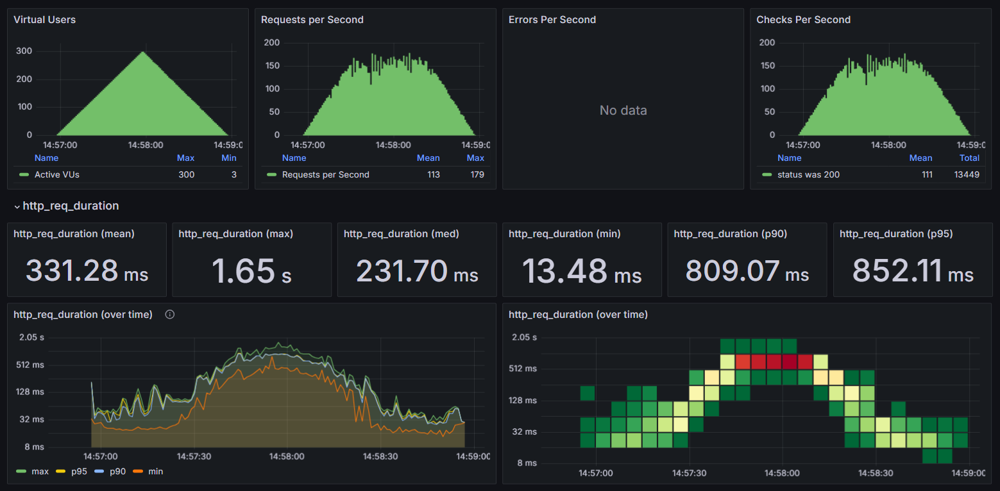

# 수행 조건
부하테스트 시 조건은 아래와 같다

### DB 데이터
1. 유저 10000명
2. 콘서트 10000건
3. 좌석 50000석 (콘서트별 50석)

### 실행 조건
1. 20초 동안 100명 
2. 20초 동안 200명
3. 20초 동안 300명
4. 20초 동안 200명
5. 20초 동안 100명
6. 20초 동안 0명

총 2분동안 max user 를 300명으로 놓고 테스트한다

# API 선정
이번 프로젝트에서 주요 API 는 아래와 같다
- 유저 토큰 발급
- 콘서트 예약 가능 날짜 / 좌석
- 좌석 예약 요청
- 잔액 충전/조회
- 결제

### 유저 토큰 발급
토큰을 발급하고 WAIT 상태의 토큰이 ACTIVE 로 변경되는 대기열을 관리하는 메인 로직이다 <br>
한번에 몇 명씩 입장하고 몇 분마다 입장 시켜야 하는지 테스트 하는 중요 API 이므로 테스트 대상이다

### 콘서트 예약 가능 날짜 / 좌석
콘서트 예약 시 일정이나 좌석은 자주 조회되는 기능이다. 특히, 날짜 조회의 경우 캐싱 처리가 되어있기에 <br>
캐싱 전 후로 유의미한 결과값이 도출될 수 있어 테스트 대상이다

### 잔액 충전 / 조회
잔액 관련 API 는 결제 시 한번 혹은 유저가 잔액이 부족해 잔액을 충전해야 하는 경우 사용된다. <br>
또한 여기선 활성 유저가 1만명인데 실제 콘서트 예매의 경우 한번에 몰리는 인원은 <br>
정말 유명한 아이유가 10만, 임영웅이 50만 이었다고 하는데 우리는 1만명 정도 대기할 것을 가정한다. <br>
따라서, 인덱스가 걸린 1만명의 데이터를 조회하는데 걸리는 시간이 길지 않고 충전도 <br>
실제로 잔액이 부족한 경우에만 발생하므로 자주 발생하는 API 가 아니라 테스트 대상에서 제외한다

### 좌석 예약 요청 / 결제
예약과 결제는 서버가 얼마나 많은 사람을 수용할 수 있는지를 결정하는 핵심 로직이다 <br>
예약을 하고 결제를 해야 사람들은 서버에서 이탈한다 <br>
이를통해, 서버의 성능을 테스트 할 수 있으므로 테스트 대상이다

# 개별 API 테스트
## 콘서트 예약 가능 날짜
예약 날짜 조회의 경우 캐싱처리가 되어있다. 캐싱 전후의 성능을 비교해보자
### 캐싱 전
p50 : 315.39 ms <br>
p90 : 878.26 ms <br>
p95 : 954.79 ms <br>
min : 15.03 ms <br>
max : 1.61 s <br>
max 와 p50 이 1초가 넘게 차이가 난다. 


### 캐싱 후
p50 : 162.34 ms <br>
p90 : 452.90 ms <br>
p95 : 532.53 ms <br>
min : 13.73 ms <br>
max : 970.48 ms <br>

max 와 p50 의 차이가 ms 의 차이이긴 하지만 max 와 p95 가 400 ms 정도 차이로 상당히 크다 <br>
소수의 API 가 성능이 떨어지는 경우가 있어 성능 개선의 여지가 존재한다


## 콘서트 예약 가능 좌석
해당 API 는 인덱스를 제외하곤 캐싱처리는 되어있지 않다. 하지만 한번에 출력하는 최대 값이 50개이고 <br>
좌석 데이터는 50만개이다. 인덱스 만으로 성능에 문제가 없을 것으로 기대했다

### 수정 전
성능에 문제가 없을 것으로 기대했는데 분석을 할 필요도 없는 결과가 나왔다. <br>
min 이 212.59 ms 인데 평균값이 6 s 가 넘는다. 문제가 있다고 생각되어 쿼리를 살펴보았다 <br>
평상시에 한번씩 테스트할 때는 큰 차이를 느끼지 못해서 확인한 적이 없었는데 <br>
(concert_detail_id=? and reserved_at is null or reserved_at<?) 와 같이 쿼리가 나가고 있었다 <br>
실행계획을 보니 인덱스를 타지 못하고 테이블 풀스캔 중이어서 이를 수정하였다

```sql
select * 
from seat 
where (deleted_at is null) 
and (concert_detail_id=? and reserved_at is null or reserved_at<?)
```


### 수정 후
p50 : 36.08 ms <br>
p90 : 278.67 ms <br>
p95 : 327.02 ms <br>
min : 10.90 ms <br>
max : 610.51 ms <br>

수정 후 ms 단위로 응답속도가 빨라짐을 볼 수 있다

```sql
select * 
from seat 
where (deleted_at is null) 
and (concert_detail_id=?)
and (reserved_at is null or reserved_at<?)
```


### 좌석 예약 요청
좌석 예약의 경우 슬랙 메시지를 보내는 외부 API 가 존재한다. 수만번의 요청이 발생하는데 <br>
그러면 슬랙 메세지가 너무 많이 보내지므로 Thread.sleep 을 통해 200 ms 동안 쉬게 로직을 수정하였다 <br>
수정 전은 슬랙 전송을 동기적으로 하고 수정 후는 이벤트를 이용해 비동기적으로 처리한다

### 수정 전
p50 : 2.80 s <br>
p90 : 5.25 s <br>
p95 : 5.59 s <br>
min : 14.63 ms <br>
max : 5.80 s <br>
보통의 API 가 초 단위로 걸린다. 아래 수정 후 속도와 비교하면 단순히 동기적으로 200 ms 밖에 느려지지 않았는데 <br>
실제 시간은 상당히 많은 차이가 있다. <br>
동기적으로 실행하면 200 ms 동안 스레드는 다른 작업을 하지 못하게 쉬게 된다. <br>
스레드의 개수는 제한이 있으므로 그만큼 다른 메서드를 처리할 수 없게 되는 것이다 <br>
하지만 비동기 처리는 바로 스레드를 할당하지 않고 메서드를 종료 시키므로 다음 작업을 처리 할 수 있어 속도가 빠르다


### 수정 후
p50 : 231.70 ms <br>
p90 : 809.07 ms <br>
p95 : 852.11 ms <br>
min : 13.48 ms <br>
max : 1.65 s <br>

max 와 p95의 차이가 있으므로 이러한 간격을 줄일 수 있는 방법이 있을지 찾아볼 수 있다




## 적합한 대기열 구하기
이를 위해 대기열 조회 로직만을 테스트해 적합한 대기열에 부하가 오지 않는 n명을 찾아 볼 것이다 <br>
초기 테스트는 아래와 같이 진행하였다 <br>

- CPU 3, Memory 2G
- 30초마다 3000명씩 토큰 발급 요청
- 한번 대기열 순번 요청 시 n초 후 재요청
- 30초에 500명씩 active 로 전환

```js
import http from 'k6/http';
import { check, sleep } from 'k6';

export const options = {
  stages: [
      { target: 5500, duration: '30s' },
      { target: 8000, duration: '30s' },
      { target: 8500, duration: '30s' },
      { target: 8000, duration: '30s' },
      { target: 7000, duration: '30s' },
      { target: 6000, duration: '30s' },
      { target: 5000, duration: '30s' },
      { target: 3000, duration: '30s' },
      { target: 1000, duration: '30s' },
      { target: 0, duration: '30s' },
  ]
}

const baseUrl = "http://host.docker.internal:8080";

export default function () {

    const memberId = Math.floor(Math.random() * 10000) + 1;

    let url = baseUrl + '/api/queue/' + memberId;

    let params = {
        headers: {
            'Content-Type': 'application/json',
            'memberId': memberId,
        },
    };

    let res = http.get(url, params);

    console.log(res);

    check(res, {
        'status was 200': (r) => r.status == 200,
    });

    sleep(10); // n
};

```

### n = 10
p50 : 2.03 s <br>
p90 : 5.55 s <br>
p95 : 6.79 s <br>
min : 4.66 s <br>
max : 60.00 s <br>
대부분의 요청이 초 단위이고 최고 오래 걸린 사람은 1분이나 대기하므로 적합하지 않는 조건이다

### n = 20
p50 : 6.25 ms <br>
p90 : 8.90 ms <br>
p95 : 11.55 ms <br>
min : 0.06 ms <br>
max : 60.00 s <br>
대부분의 요청이 ms 단위이다. 하지만 최대 시간이 1분이므로 이또한 적합하지 않은 조건이다

### n = 15
15초의 경우 20과 크게 차이가 없어 좀 더 빠른 응답을 받는것이 좋으므로 n은 15로 결정하였다

현 테스트를 기반으로 한번에 들어올 수 있는 사람의 수를 변경해보았다 <br>
최대 걸리는 시간을 ms 단위로 줄이기 위해 http_req_duration 을 보니 200ms 정도 성능을 보장하는 <br>
시점이 400 tps 정도이고 virtual user 가 6천 정도일 때 ms 단위의 요청속도를 보장하였다 <br>
따라서, 아래와 같이 테스트 조건을 변경하였다 <br>
아래와 같이 테스트를 진행하면 대기열 순번을 요청하는 최대 유저가 6500 이 된다.

- 30초마다 1500명씩 토큰 발급 요청
- 한번 대기열 순번 요청 시 15초 후 재요청
- 30초에 500명씩 active 로 전환

```js
export const options = {
    stages: [
        { target: 1000, duration: '30s' },
        { target: 2000, duration: '30s' },
        { target: 3000, duration: '30s' },
        { target: 4000, duration: '30s' },
        { target: 5000, duration: '30s' },
        { target: 6000, duration: '30s' },
        { target: 6500, duration: '30s' },
        { target: 6000, duration: '30s' },
        { target: 4000, duration: '30s' },
        { target: 2000, duration: '30s' },
        { target: 0, duration: '30s' },
    ]
}
```

### 결과
변경한 조건으로 테스트를 진행해보니 max 값이 290ms 로 요청 시간이 짧아진 것을 볼 수 있었다 <br>
단순 대기열 유량 제어는 성공했으므로 추후, 복합 로직에서도 해당 조건을 사용할 것이다 <br>
하지만, active 유저가 활동할 때 결과값은 아니므로 값은 변경될 수 있다

p50 : 6.53 ms <br>
p90 : 8.69 ms <br>
p95 : 10.01 ms <br>
min : 4.32 ms <br>
max : 290.60 ms <br>


# 장애 대응
대기열과 다른 API 를 같이 실행하니 위 조건으로는 성능이 나오지 않았다 <br>
실행 결과 평균 요청 시간은 5초를 넘고 최대는 20초가 넘었다 <br>
따라서, 위 조건으로 테스트 시 원하는 성능이 나올 수 없다고 생각했다

## 장애 발생 가능 요소
```text
1. 대기열 풀링

위 조건에서 대기열 자체가 400 TPS 가 나왔는데 이 이상이 되면 풀링 자체로도 요청이 길어졌다
서버당 100정도의 TPS 를 맞추기 위해 2~3 대의 서버를 준비하면 풀링에 문제가 없을듯 하다

또한, 풀링의 주기가 15초인데 redis 연산을 통해 1만번째 이상의 순위는 풀링의 주기를
30초 혹은 그 이상으로 늘리면 부하를 줄일 수 있다

마지막으로 active 되는 유저는 우리가 제어할 수 있지만 wait 상태로 대기하는 유저의 수는 제어할 수 없다
위에서 말한것 처럼 풀링의 주기를 조절할 수도 있지만 카프카를 이용해 서버는 현재 redis 에 들어와 있는
마지막 wait 사용자의 순번만 확인하고 일정 인원 이하가 되면 카프카에서 가져오는 방식으로 유량 제어를 하면 
부하를 더 줄일 수 있다

2. 좌석 조회

좌석 예약의 경우 서비스에서 가장 많은 API가 호출될 수 있는 요소이다
콘서트를 선택하고 좌석을 선택했는데 이미 예약이 되버리면 새로고침을 하여 다시 좌석을 가져와야 하기 때문이다
그래서 테스트 시에도 1 ~ 10 번 까지 한명의 유저가 호출할 수 있다고 테스트했는데 성능 저하 문제가 있었다

이를 막기 위해 현재는 콘서트 별 좌석 전체를 가져오고 있지만 실제 콘서트장은 구역이 나누어져 있다
각 좌석별로 구역을 지정하여 최대한 잘게 쪼개어 한번에 조회하는 좌석의 양을 줄여야한다
또한, 현재는 캐시가 걸려있지 않는데 캐시를 통해 부하를 줄이는 것이 바람직해 보인다
좌석을 구역별로 잘게 쪼개면 해당 구역에 대해서 캐시 evict 가 발생하기에 전체 좌석에 대해 
캐시로 관리하는 것 보다 더 효율적으로 쓸 수 있다 

3. 결제
예약의 경우 예약까지 모든 과정을 마치고 들어온 유저가 진행할 수 있다
그래서 더블클릭을 하거나 하지 않는 이상 한명의 유저가 하나의 결제를 하게 되는데
다른 API 에 비해 요청이 많이 발생하진 않는다

하지만, 현재 예약 검증, 잔액 차감, 좌석 예약, 결제가 하나의 트랜잭션으로 묶여있다
위 과정이 순서가 중요해 해당 방식으로 구현했는데 현실에서 결제는 외부 API를 사용하게 된다
그러면 결제가 끝날 때까지 트랜잭션이 묶여 있을 수 있으므로 외부 API를 사용하는 결제를 이벤트로 분리해야한다

또한 예약 검증, 잔액 차감, 좌석 예약도 하나의 트랜잭션이 아닌 이벤트 호출 방식으로 변경할 수 있다
위 과정에서 예약 조회, 유저 수정, 좌석 수정이 발생하는데 유저는 많이 조회되지 않는다
그리고 예약은 같은 건에 대해 수정이나 조회가 발생할 일이 적어 문제가 없는데
좌석의 경우 유저가 지속적으로 조회를 하고 있어 문제가 발생할 수 있다
이를 이벤트로 처리함으로써 좌석 수정 시 디비에 부하를 줄일 수 있다
```